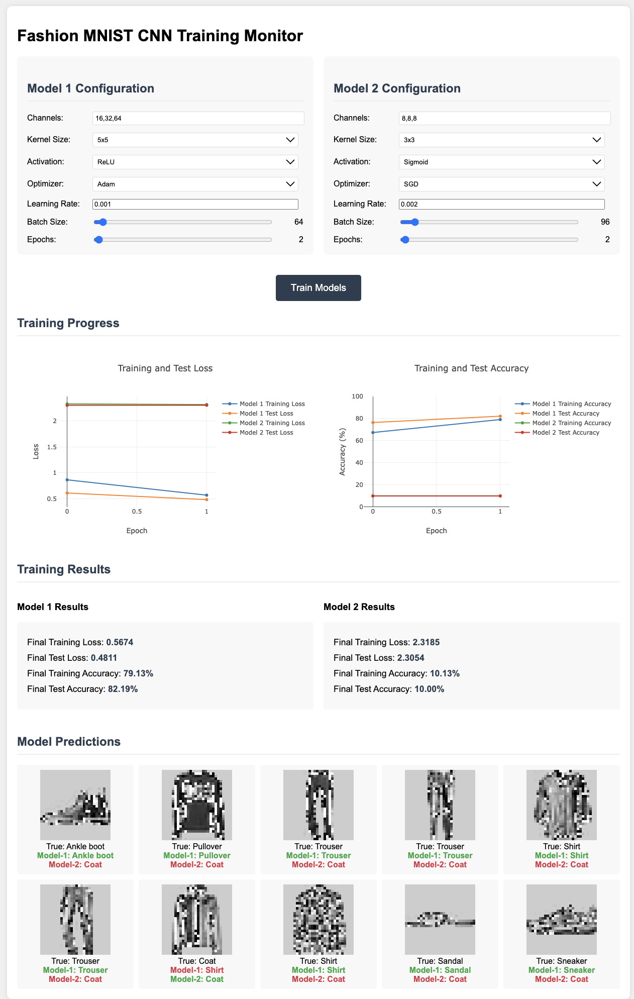

# Fashion MNIST CNN Training Visualizer

This project implements a comparative study of two Convolutional Neural Networks (CNNs) trained on the Fashion MNIST dataset with real-time training visualization. Users can configure and train two different models simultaneously and compare their performance.

## Features

### Model Configuration
- Configurable CNN architecture for both models
  - Channel sizes (e.g., 16,32,64 or 8,8,8)
  - Kernel size (3x3, 5x5, 7x7)
  - Activation function (ReLU, Sigmoid)
  - Optimizer (Adam, SGD)
  - Learning rate
  - Batch size (1-1000)
  - Number of epochs (1-100)

### Real-time Visualization
- Live training progress for both models
- Combined loss curves (training and test)
- Combined accuracy curves (training and test)
- Side-by-side final results comparison
- Visual prediction results on test samples

### Technical Features
- CUDA support for GPU acceleration
- Parallel training of two models
- Interactive web interface
- Real-time metric updates
- Automatic result visualization

## Requirements

- Python 3.8+
- PyTorch
- Flask
- NumPy
- Matplotlib
- tqdm

## Installation

1. Clone the repository:
```bash
git clone <repository-url>
cd fashion-mnist-cnn-visualizer
```

2. Create and activate a virtual environment:
```bash
# Create virtual environment
python -m venv venv

# Activate virtual environment
# On Windows:
venv\Scripts\activate
# On Unix or MacOS:
source venv/bin/activate
```

3. Install requirements:
```bash
pip install -r requirements.txt
```

## Usage

1. Start the Flask server:
```bash
python server.py
```

2. Open your web browser and navigate to:
```
http://localhost:5000
```

3. Configure both models:
   - Set channel sizes
   - Choose kernel size
   - Select activation function
   - Choose optimizer
   - Set learning rate
   - Adjust batch size
   - Set number of epochs

4. Click "Train Models" to start training both models simultaneously

5. Monitor the training progress:
   - Watch real-time loss and accuracy curves
   - View final results when training completes
   - Compare model predictions on test samples

## Sample Output



## Project Structure
```
.
├── requirements.txt    # Project dependencies
├── train.py           # Model and training implementation
├── server.py          # Flask server implementation
├── templates/         # HTML templates
│   └── index.html     # Main web interface
└── static/            # Generated files during training
    ├── model1_progress.json
    ├── model2_progress.json
    ├── model1_samples.npy
    ├── model2_samples.npy
    ├── model1_model.pth
    └── model2_model.pth
```

## Implementation Details

### Model Architecture
- 3 convolutional layers with configurable channels
- MaxPooling after each convolution
- Adaptive Average Pooling
- Fully connected layers with dropout
- Configurable activation functions

### Training
- Simultaneous training of two models
- Real-time progress tracking
- Automatic GPU utilization when available
- Separate thread for each model's training
- Progress persistence across page refreshes

### Visualization
- Combined loss plots for easy comparison
- Combined accuracy plots
- Side-by-side final metrics
- Visual prediction results with color-coded accuracy

## Notes
- Make sure you have CUDA installed if you want to use GPU acceleration
- The application will automatically use GPU if available, otherwise will fall back to CPU
- Training progress is maintained even if the browser is refreshed
- Previous training results are cleared when starting new training
